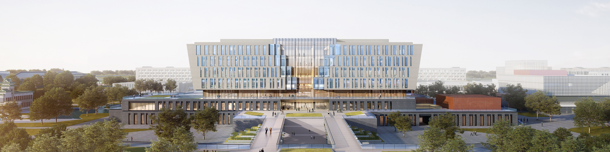

 

<h2 id="about">
<picture>
<source media="(max-width: 600px)" srcset="assets/section-about-mobile.svg">

</picture>
</h2>

我们为农业构建<b>可计算的活细胞模型</b>。研究方向横跨合成生物学、系统生物学与机器学习：在计算机中重建作物相关微生物与植物细胞，模拟它们在遗传扰动与环境胁迫下的行为，并用预测结果反过来指导生物系统的理性设计——在动手做湿实验之前。

我们想要的是一个<b>闭环</b>：从基因组到模型，从模型到预测，从预测回到实验台。

 

We build <b>computable models of living cells</b> for agriculture. Our work sits at the intersection of synthetic biology, systems biology and machine learning: we reconstruct crop-associated microbes and plant cells <i>in silico</i>, simulate how they behave under genetic and environmental perturbation, and use those predictions to design better biological systems before touching a pipette.

The goal is a <b>closed loop</b> — from genome to model, from model to prediction, from prediction back to the bench.

 

<h2 id="research-directions">
<picture>
<source media="(max-width: 600px)" srcset="assets/section-research-mobile.svg">

</picture>
</h2>

<table>
<tr>
<td width="50%" valign="top">

<h3>01 · 全细胞模型 / Whole-Cell Modelling</h3>

<b>机制驱动的基因组尺度重建</b>：把代谢、基因调控与生长整合进同一个模型。

Mechanistic, genome-scale reconstructions of agricultural microbes and plant cells — metabolism, gene regulation and growth in one integrated model.

<code>GEM</code> <code>FBA / dFBA</code> <code>Kinetic Models</code> <code>SBML</code>

</td>
<td width="50%" valign="top">

<h3>02 · AI 虚拟细胞 / AI Virtual Cell</h3>

<b>基于单细胞多组学训练基础模型</b>，预测细胞对未见过的遗传/化学扰动的响应。

Foundation models trained on single-cell multi-omics that predict cellular response to unseen genetic and chemical perturbations.

<code>Foundation Models</code> <code>Perturbation Prediction</code> <code>scRNA-seq</code> <code>Graph Learning</code>

</td>
</tr>
<tr>
<td width="50%" valign="top">

<h3>03 · 农业数字孪生 / Digital Twins for Agriculture</h3>

<b>根际微生物组、共生固氮体系与作物细胞的数字孪生</b>——把细胞模型与田间表型连起来。

Digital twins of the rhizosphere, nitrogen-fixing symbionts and crop cells — linking cellular models to field-scale phenotype.

<code>Rhizosphere</code> <code>N₂ Fixation</code> <code>Multi-scale Modelling</code>

</td>
<td width="50%" valign="top">

<h3>04 · 设计—构建—测试—学习闭环 / DBTL Loop</h3>

<b>自动化 DBTL 流水线</b>：元件库、线路设计、模型引导的实验选择，反馈回湿实验。

Automated DBTL pipelines: part registries, circuit design, and model-guided experiment selection feeding back into the wet lab.

<code>Part Registry</code> <code>Circuit Design</code> <code>Active Learning</code> <code>Lab Automation</code>

</td>
</tr>
</table>

 

<h2 id="projects">
<picture>
<source media="(max-width: 600px)" srcset="assets/section-projects-mobile.svg">

</picture>
</h2>

> **本组织新建，以下为规划中的仓库结构。建好后把链接换成真实地址即可。**
> The organization is newly created — repositories below are the planned structure.

| Repository | 简介 · Description | Status |
|:--|:--|:--|
| <code>virtual-cell-core</code> | **全细胞模型仿真引擎** · Simulation engine for whole-cell models |  |
| <code>genome-scale-models</code> | **农业微生物与作物的基因组尺度代谢模型库** · Curated GEMs of agricultural microbes & crops |  |
| <code>cell-foundation-model</code> | **单细胞基础模型与扰动预测** · Single-cell foundation model & perturbation prediction |  |
| <code>digital-rhizosphere</code> | **作物根际微生物组数字孪生** · Digital twin of the crop rhizosphere microbiome |  |
| <code>syn-parts-registry</code> | **标准化元件与线路库** · Standardized part & circuit registry |  |
| <code>dbtl-pipeline</code> | **DBTL 自动化流水线** · Automated Design–Build–Test–Learn workflows |  |

 

<h2 id="get-in-touch">
<picture>
<source media="(max-width: 600px)" srcset="assets/section-contact-mobile.svg">

</picture>
</h2>

 

 

<b>农业合成生物学中心</b> 
<b>南京农业大学前沿交叉研究院</b> 
<b>江苏省南京江北新区滨江大道666号</b>

<b>Center for Agricultural Synthetic Biology</b> 
<b>Academy for Advanced Interdisciplinary Studies, Nanjing Agricultural University</b> 
<b>No. 666 Binjiang Avenue, Jiangbei New Area, Nanjing, Jiangsu Province</b>

