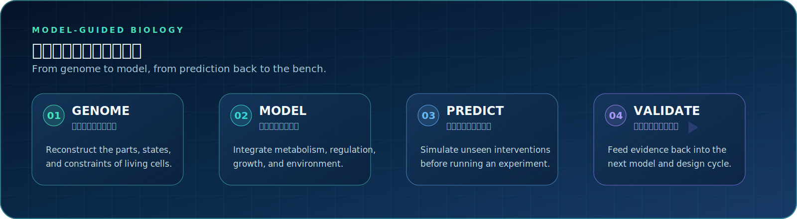

 

## We make living cells computable.

<table>
<tr>
<td width="64%" valign="top">

<h3>农业生命系统的建模、预测与理性设计</h3>

我们在<strong>合成生物学、系统生物学与机器学习</strong>的交汇处开展研究：在计算机中重建作物相关微生物与植物细胞，模拟它们在遗传扰动与环境胁迫下的行为，并让预测结果反过来指导湿实验。

We reconstruct crop-associated microbes and plant cells <em>in silico</em>, predict their responses to genetic and environmental perturbations, and use those predictions to guide rational biological design — <strong>before touching a pipette</strong>.

</td>
<td width="36%" valign="top">

<h3>Research at a glance</h3>

<ul>
<li><code>04</code> interconnected research axes</li>
<li><code>01</code> genome-to-bench closed loop</li>
<li><code>∞</code> model · predict · design · validate</li>
<li>Open models, open tools, reproducible science</li>
</ul>

</td>
</tr>
</table>

 

## Research directions · 研究方向

<table>
<tr>
<td width="50%" valign="top">

<h3>🧬 Whole-Cell Modelling</h3>
<h4>全细胞模型</h4>

Mechanistic, genome-scale reconstructions integrating <strong>metabolism, gene regulation and growth</strong> in one computable system.

机制驱动的基因组尺度重建：把代谢、基因调控与生长整合进同一个可计算模型。

<code>GEM</code> <code>FBA / dFBA</code> <code>Kinetic Models</code> <code>SBML</code>

</td>
<td width="50%" valign="top">

<h3>◈ AI Virtual Cell</h3>
<h4>AI 虚拟细胞</h4>

Foundation models trained on single-cell multi-omics to predict cellular responses to <strong>unseen genetic and chemical perturbations</strong>.

基于单细胞多组学训练基础模型，预测细胞对未见过的遗传与化学扰动的响应。

<code>Foundation Models</code> <code>Perturbation</code> <code>scRNA-seq</code> <code>Graph Learning</code>

</td>
</tr>
<tr>
<td width="50%" valign="top">

<h3>◉ Agricultural Digital Twins</h3>
<h4>农业数字孪生</h4>

Digital twins of the rhizosphere, nitrogen-fixing symbionts and crop cells, linking <strong>cellular mechanisms to field phenotype</strong>.

构建根际微生物组、共生固氮体系与作物细胞的数字孪生，连接细胞机制与田间表型。

<code>Rhizosphere</code> <code>N₂ Fixation</code> <code>Multi-scale Modelling</code>

</td>
<td width="50%" valign="top">

<h3>⟲ Design–Build–Test–Learn</h3>
<h4>DBTL 闭环</h4>

Automated pipelines for part registries, circuit design and <strong>model-guided experiment selection</strong>, feeding evidence back to the bench.

自动化元件库、线路设计与模型引导的实验选择，让数据持续反馈并改进下一轮设计。

<code>Part Registry</code> <code>Circuit Design</code> <code>Active Learning</code> <code>Automation</code>

</td>
</tr>
</table>

## Project constellation · 项目矩阵

> This organization is being built in the open. The repositories below describe the planned architecture and will become active as each module is released.

| Repository | Mission | Layer | Status |
|:--|:--|:--:|:--:|
| **`virtual-cell-core`** | Whole-cell simulation engine · 全细胞模型仿真引擎 | Core |  |
| **`genome-scale-models`** | Curated agricultural GEMs · 农业基因组尺度模型库 | Data |  |
| **`cell-foundation-model`** | Perturbation-aware cell foundation model · 单细胞基础模型 | AI |  |
| **`digital-rhizosphere`** | Rhizosphere microbiome digital twin · 根际微生物组数字孪生 | Twin |  |
| **`syn-parts-registry`** | Standardized biological parts and circuits · 标准化元件与线路库 | Build |  |
| **`dbtl-pipeline`** | Automated Design–Build–Test–Learn workflows · DBTL 流水线 | Loop |  |

 

<h3>Open science. Open models. Impact for agriculture.</h3>

<strong>开放科学 · 开放模型 · 服务农业</strong>

 

农业合成生物学中心 · 南京农业大学前沿交叉研究院 
Center of Agricultural Synthetic Biology · Academy for Advanced Interdisciplinary Studies 
No. 666 Binjiang Avenue, Jiangbei New Area, Nanjing, Jiangsu Province

